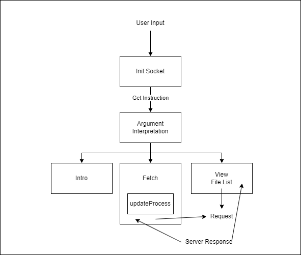
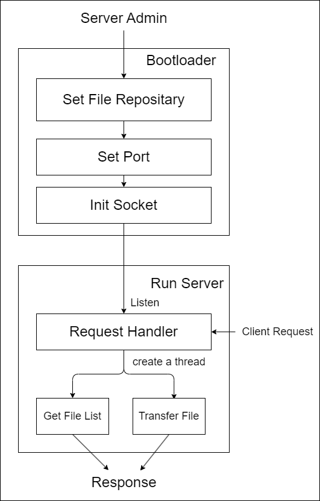

# ezTransferer

An easy file transferer based on socket, using C/C++

## Introduction

The project is made up of two part: server and client

### Client Design

- First Layer: Argument Interpretation
- Second Layer: Command Execution
    - Intro: Introduce the usage of arguments
    - Transferer: 
        - Before initing a socket tunnel, check input path where the file will be downloaded 
        - After passing the check, init a socket and send file transfer request, while create download bar to tell the progress.

### Server Design

similar to Client. Here the Path means the file repository
